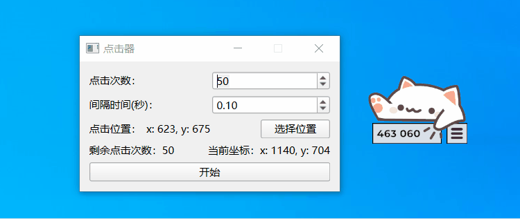

# bongo_clicker
邦鼓猫点击器

一个基于 PySide6 的自动点击器工具，可以在指定位置点击，用来解锁 [Bongo Cat](https://store.steampowered.com/app/3419430/Bongo_Cat/) 成就，也可以用来点 [POPCAT](https://popcat.click/) 。适用于Windows系统

## 依赖
- PySide6
- pywin32


## 使用方法

安装依赖：

```bash
pip install -r requirements.txt
```

运行程序：

```bash
python clicker.py
```


1. 设置点击次数和间隔时间
2. 点击“选择位置”按钮并在屏幕选择点击位置
3. 点击“开始”按钮启动点击



## 注意
1. 默认最大点击次数1000000次
2. 点击过程中鼠标移动受限，可以点击**鼠标右键**停止
3. 点击间隔太小时（小于0.1s），Windows会对点击动作去抖，使得 Bongo Cat 的计数值小于设定的点击次数